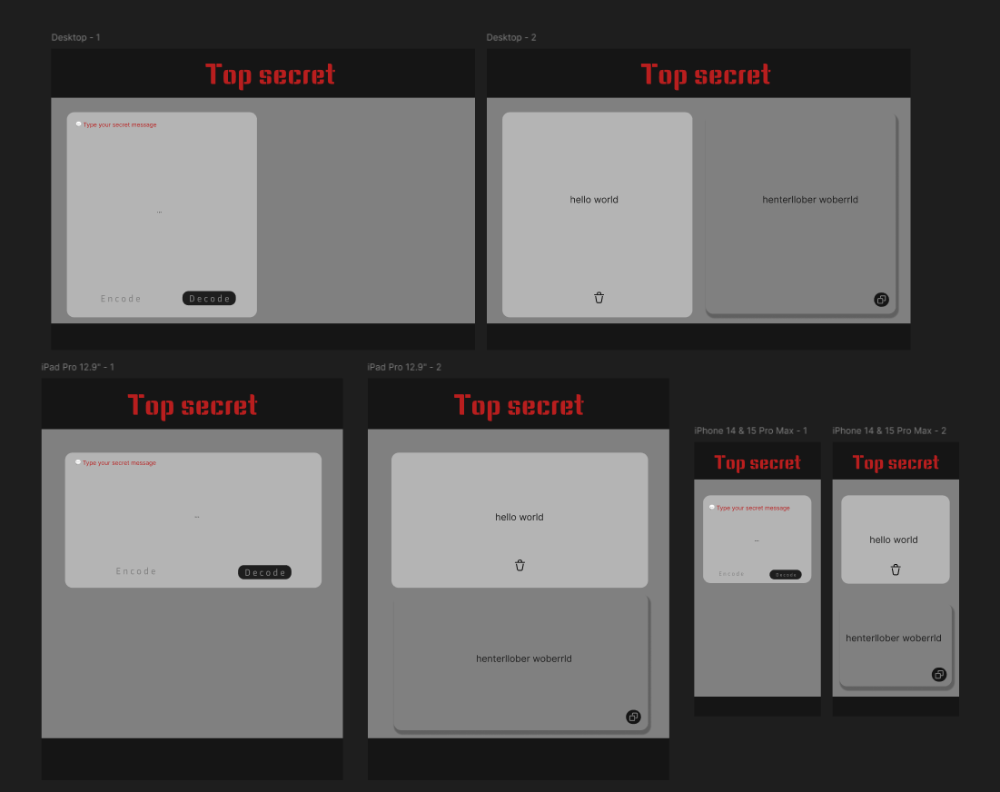

# Top Secret

[Top Secret website](https://kimrv000.github.io/top_secret/)

In this website you can encode and decode secret messages.

## Specifications

Top Secret was developed using:

- HTML5
- CSS
- JavaScript

It's a responsive project sketched in Figma following the mobile-first design.

### Buttons
- **Encode Button**: Transform your message into a secure format. Click to encode your text and protect it from easy access.

- **Decode Button**: Reveal the original content of your encoded message. Click to decode and uncover the true meaning.

- **Copy Button**: Easily share your message by copying it to the clipboard with a single click. Perfect for quick sharing.

- **Delete Button**: Quickly clear the current message to start typing a new one. Ideal for fast and seamless message changes.
